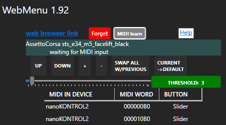

[*back*](README.md#plan)

## WebMenu MIDI
Directly support MIDI device inputs for controlling property change actions.
- alternative to mouse and joystick events
- instead of queueing [BoundedChannel](Channel.md) MIDI payloads,  
  queue [`SemaphoreSlim SemaphoreQueue` Tasks](SemaphoreSlim.md) for `PayloadHandler()`
- restore learned MIDI from `Settings.midiDevs` and `Resume()` after game changes

SimHub **Controls and events** handles **Controllers** joystick button, but not axis events.
### To do:
- Stop unused **MIDI IN** (`mMidiIn`) devices after **MIDI learn**
- enable deleting listed buttons
- Handle joystick axis for Slider

### Done:
- Now that click list is displayed, hide **Forget** until relevant
- prompt using button labels instead of names
- update `mg` DataGrid click list edit screen, which replaces `dg` DataGrid for **MIDI learn**
	
- log active MIDI devices
- refactor Resume()
	- preserve learnings for ProductNames currently unavailable
#### MIDI Init
Available devices may change at any time;  
- check `MidiIn.DeviceInfo` on every `Init()`;
	- extract `available` and `used` ProductName Lists
- sort `Settings.midiDevs` into `lMidiIn` and `unused`

#### `MIDI.Stop()`
if changed,
- convert `lMidiIn` back to `Settings.midiDevs`
	- then Concat `unused` to `Settings.midiDevs`
